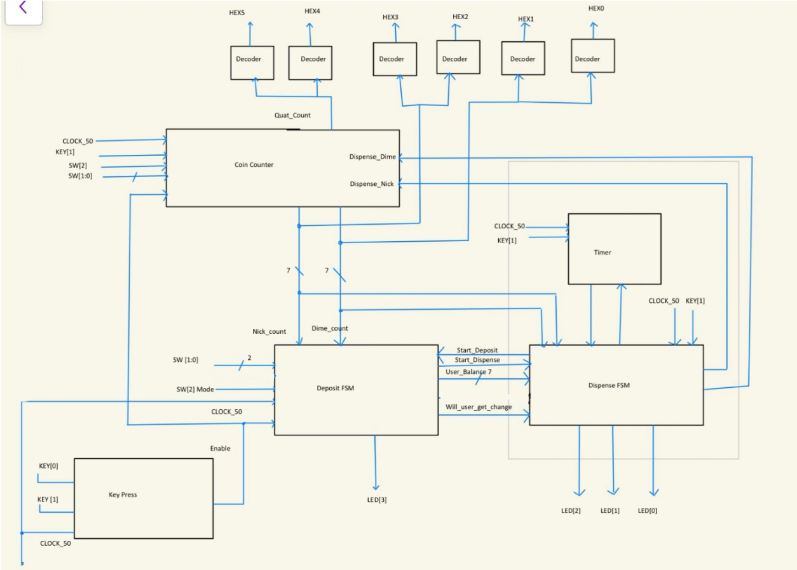
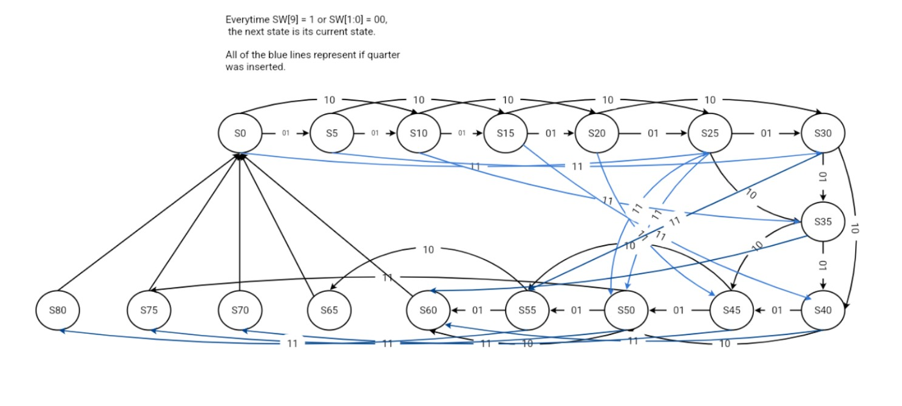
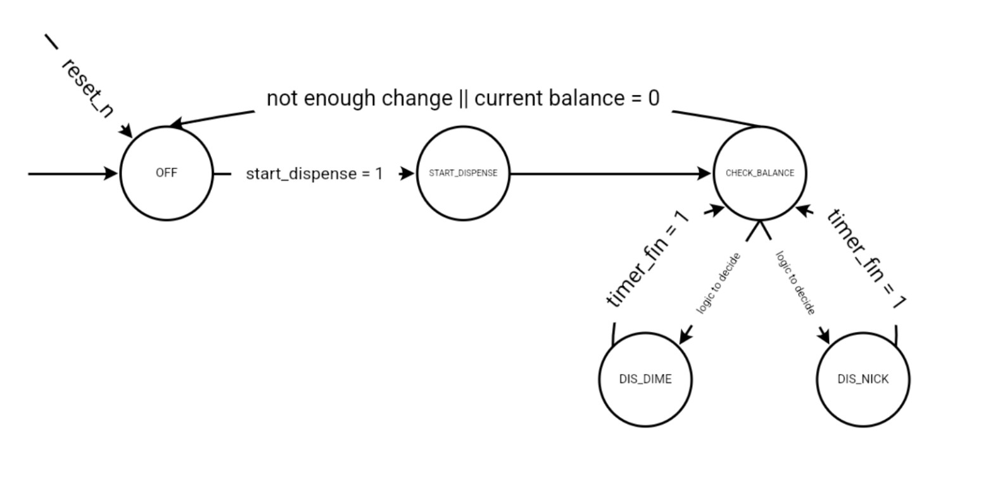
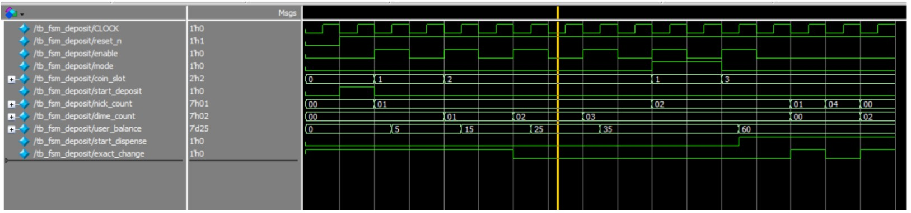
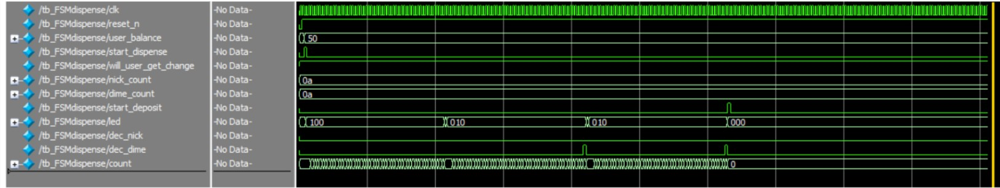
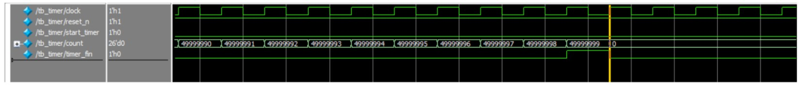
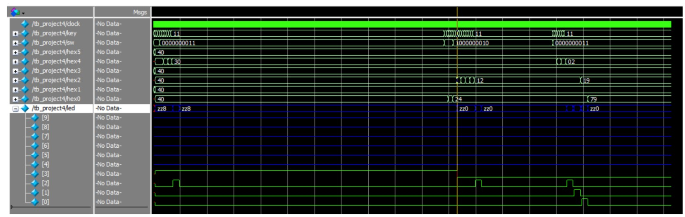

# Synchronous Vending Machine Controller

A dual Finite State Machine (FSM) vending machine controller written in Verilog HDL. The system tracks coin deposits, dispenses a 60-cent product, calculates and returns change using dimes and nickels, and drives LED indicators and 7-segment display readouts.

---

## System Overview

The controller is divided into two primary state machines and supporting peripheral modules:

* **Deposit FSM:** Tracks accumulated coin deposits across 17 distinct states ($0 to $80 in 5-cent increments). It handles user/maintenance mode logic and signals the Dispense FSM when the 60-cent target is reached.
* **Dispense FSM:** Manages the dispensing sequence (`OFF`, `START_DISPENSE`, `CHECK_BALANCE`, `DIS_DIME`, `DIS_NICK`). It works with a hardware timer to pulse product and change LEDs for 1 second each.
* **1-Second Timer:** A 26-bit counter running on the DE1-SoC's 50 MHz clock that counts to 49,999,999 to generate exact 1-second delay pulses (`timer_fin`).
* **Coin Counter:** Uses three 7-bit registers to track nickel, dime, and quarter inventory, updating automatically on coin insertion or change release with built-in underflow protection.
* **Display Decoders:** 6-digit seven-segment display decoders that display real-time coin counts and user balance.

---

## Block Diagram

<!-- INSERT IMAGE HERE -->

---

## State Diagrams

### Deposit FSM
Tracks incoming coins and manages transitions up to the dispensing threshold.

<!-- INSERT IMAGE HERE -->

### Dispense FSM
Controls product delivery and change calculations based on remaining balance and coin inventory.

<!-- INSERT IMAGE HERE -->

---

## Simulation & Verification

All modules were individually verified in Siemens QuestaSim before full DE1-SoC integration:

### Deposit FSM Verification
Verified that `Start_Dispense` triggers cleanly once the accumulated total hits $0.60 in user mode.

<!-- INSERT IMAGE HERE -->

### Timer & Dispense Subsystem
Verified that the 26-bit counter triggers `timer_fin` accurately at 1 second (1.00000008 s in simulation) to hold LED pulses for the correct duration.

<!-- INSERT IMAGE HERE -->

### Top-Level System Test
Simulated end-to-end scenarios including normal dispensing, maintenance mode lockout, exact change conditions, and sequential change return (e.g., dispensing 15 cents as a dime followed by a nickel).

<!-- INSERT IMAGE HERE -->

---

## Environment & Tools

* **Language:** Verilog HDL
* **Simulation:** Siemens QuestaSim
* **Target Hardware:** Terasic DE1-SoC FPGA Board (50 MHz Clock, Switches `SW`, Push Buttons `KEY`, Red LEDs `LEDR`, 7-Segment Displays `HEX`)
